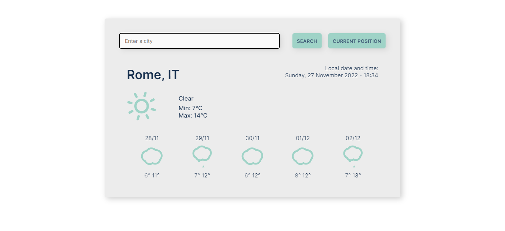

# React Weather App

Weather app built with React and ViteJS.

## Link

- [Project URL](https://react-weather-forecast-website.netlify.app/) (hosted on Netlify)

## Screenshot

## Project

Users should be able to:

- Check the current weather and forecast of the city entered in the input field
- Check the current weather and forecast of the user's current location
- See the local date and time of the searched location

## Built with

- Semantic HTML5 markup
- CSS custom properties
- [CSS Modules](https://github.com/css-modules/css-modules)
- JavaScript
- React
- [Vite](https://vitejs.dev/)
- [axios](https://axios-http.com/)
- Geocoding API from [openweathermap.org](https://openweathermap.org/)
- [7timer.info API](http://www.7timer.info/doc.php)
- Timezone API from [ipgeolocation.io](https://ipgeolocation.io/)
- [Flaticon](https://www.flaticon.com/) for the favicon
- [React Spinners](https://www.npmjs.com/package/react-spinners)
- [React Animated Weather](https://www.npmjs.com/package/react-animated-weather)

## Author

Chiara Stefanelli - Front-End Development Student based in Italy

- Website - [Chiara Stefanelli](https://chiarastefanelli.netlify.app/)
- LinkedIn - [Chiara Stefanelli](https://www.linkedin.com/in/chiarastefanelli/?locale=en_US)
